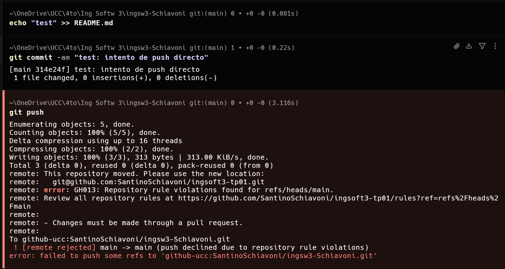
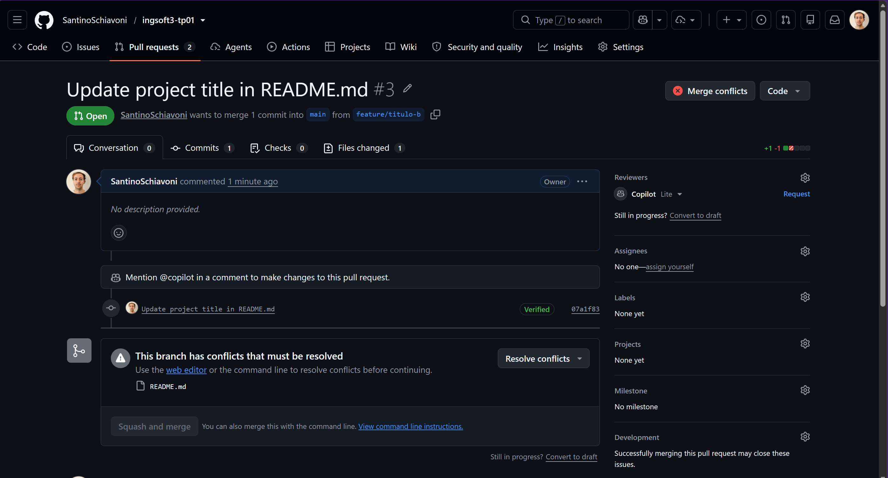
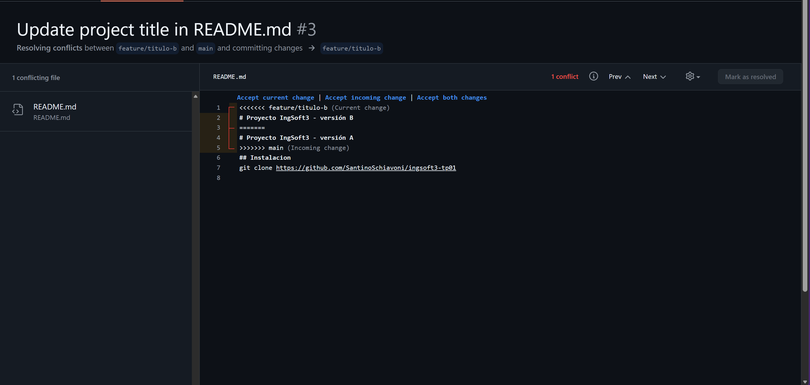
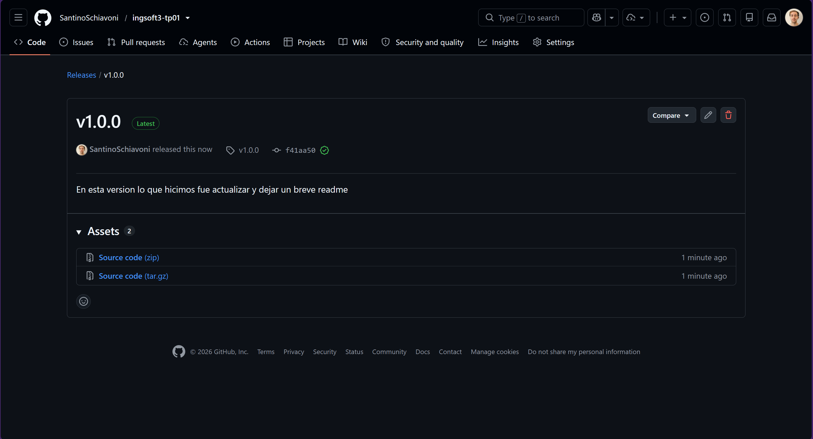

# Evidencias — TP1

## 1. Push directo a main rechazado

GitHub rechaza el push porque main está protegida y la regla alcanza también al dueño del repo.

## 2. El PR de la rama B no se puede mergear: conflicto

## 3. Resolver conflictos de la PR

## 4. Lanzamiento de nueva version con un tag y release
